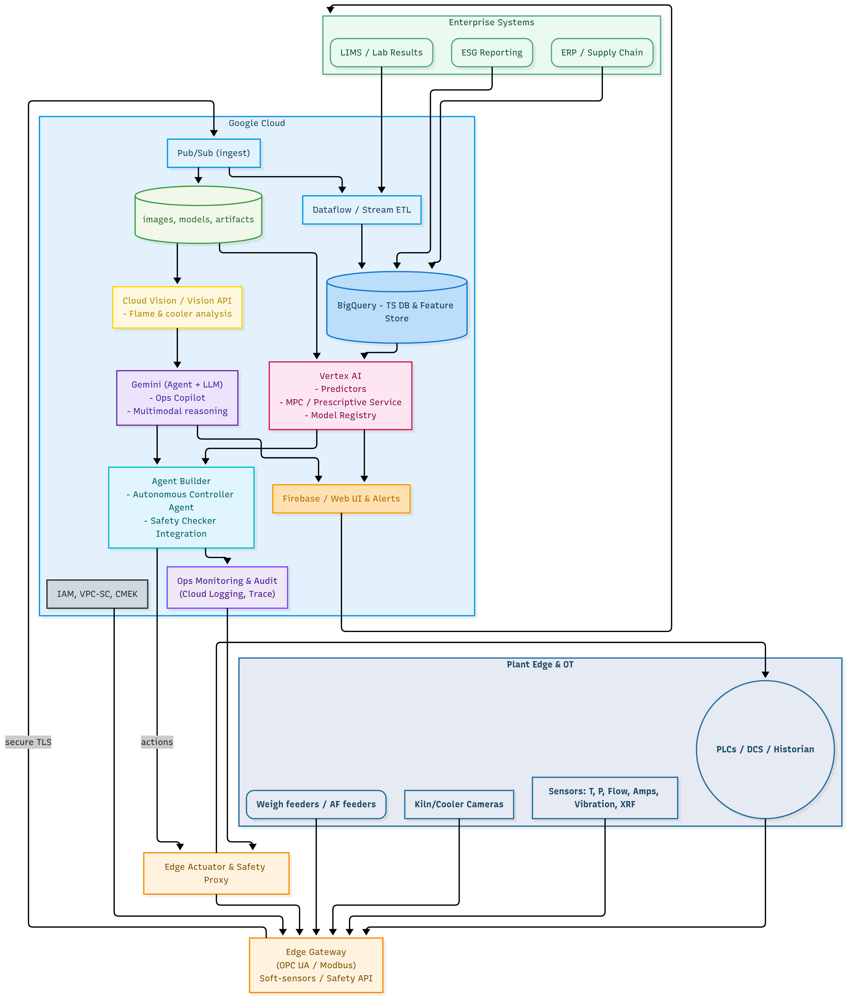

---

# 🏭 CemMind AI – Generative Intelligence for Smarter Cement Plants

CemMind AI is a **Generative AI–driven platform** for **autonomous cement plant operations**, built to optimize **energy use, quality, and sustainability** across processes.

This Proof of Concept (POC) shows how **GenAI + digital twin simulations** can power a smarter, greener cement industry — even without real sensors.

---

## ⚡ Problem Background

Cement plants are **energy-hungry giants**.
They struggle with:

* Variability in raw material quality
* Grinding inefficiencies and kiln instability
* High energy demand during clinkerization
* Quality fluctuations in clinker and cement
* Difficulty using **alternative fuels** at scale
* Siloed process controls → no cross-process optimization

With cement contributing **7–8% of global CO₂ emissions**, the industry urgently needs **AI-driven sustainability and efficiency**.

---

## 🎯 Objective

CemMind AI aims to:

* Reduce **energy waste** 🔋
* Stabilize **production quality** 📊
* Maximize **alternative fuel use** 🌱
* Enable **autonomous cross-process decision-making** 🤖

---

## 🛠 Solution Overview

CemMind AI integrates:

* **🧠 GenAI Copilot** → Process recommendations using Vertex AI (Gemini)
* **📈 Digital Twin Simulator** → Generates synthetic kiln/mill/quality data
* **⚡ Anomaly & Drift Detection** → Spot inefficiencies before they escalate
* **🌍 Sustainability Engine** → Monitor CO₂ & optimize thermal substitution rate
* **📊 Interactive Dashboard** → Operator-friendly cockpit with AI insights

---

---

# ✅ Prototype Roadmap

1. **Simulate data**: Write a Python script to generate plant-like data.
2. **Stream/upload data**: Push into Firebase/BigQuery as if from sensors.
3. **AI layer**: Use Gemini/Vertex AI to generate insights & optimization suggestions.
4. **UI**: Build a simple dashboard + chatbot assistant (your Flutter app is perfect here).
5. **Demo**: Show scenarios where AI stabilizes operations, optimizes energy, or balances AF use.

---

⚡ Essentially: *Fake the sensors, but keep the AI + dashboard real*.
That way, stakeholders see **the full loop working**, just with a **synthetic digital twin** instead of a real cement plant.

---
## 🏗 System Architecture



## 📂 Repo Structure

```
CEMMIND-AI/
│── README.md
│── requirements.txt
│
├── data/                        
│   └── simulated_cement_plant_data.csv
│
├── simulation/                  
│   ├── batch_generator.py       
│   ├── realtime_simulator.py    
│
├── ai_models/                   
│   ├── generative_controller.py 
│   ├── anomaly_detector.py      
│   ├── optimizer.py             
│
├── services/                    
│   ├── api/app.py               
│   ├── dashboard/app.py         
│   └── cloud/                   
│       ├── bigquery_client.py
│       ├── vertex_ai_client.py
│       ├── pubsub_client.py
│       └── storage_client.py
│
└── docs/
    ├── architecture.png
    ├── workflow.md
    └── references.md
```

---

## ▶️ Quick Start

### 1️⃣ Install dependencies

```bash
pip install -r requirements.txt
```

### 2️⃣ Generate batch simulation data

```bash
python simulation/batch_generator.py
```

### 3️⃣ Run real-time simulator

```bash
python simulation/realtime_simulator.py
```

### 4️⃣ Launch dashboard (demo UI)

```bash
streamlit run services/dashboard/app.py
```

### 5️⃣ (Optional) Connect with Google Vertex AI

```bash
python services/cloud/vertex_ai_client.py
```

---

## 📊 Dashboard Features

* **Live KPIs** → kiln temp, mill power, AF rate, CO₂ emissions
* **GenAI Copilot** → Natural language Q\&A + optimization suggestions
* **What-if Scenarios** → Simulate AF substitution or grinding strategies
* **Anomaly Alerts** → Detect kiln instability or quality drifts
* **Sustainability Metrics** → CO₂ per ton, AF substitution trends

---

## 🌱 Sustainability Impact

* Improve **thermal substitution rate** with AI modeling
* Lower **CO₂ emissions** with efficient process control
* Achieve **energy savings** across grinding, kiln, and utilities

---

## 🚀 Tech Stack

* **Simulation**: Python (NumPy, Pandas, Faker)
* **AI Models**: Vertex AI (Gemini), Cloud Vision
* **Data**: BigQuery, Pub/Sub, Cloud Storage
* **Frontend**: Streamlit / Flutter + Firebase
* **Backend**: FastAPI / Flask

---

## 📌 Next Steps

* Hook into **real plant OT sensors** (OPC UA, Modbus)
* Deploy **Vertex AI pipelines** for continuous training
* Add **control integration** for autonomous closed-loop ops
* Expand ESG impact with **carbon accounting module**

---

🔥 **CemMind AI – The Brain of Future Cement Plants**
*Think smarter. Burn less. Build greener.* 🌍

---
